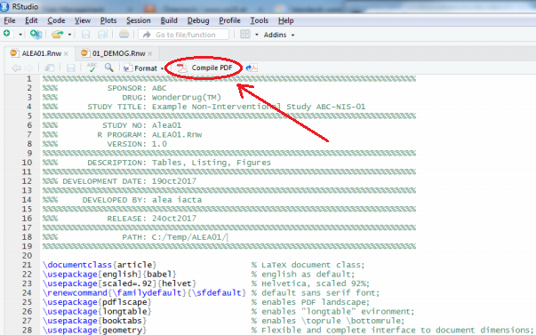
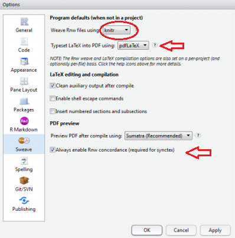

<!-- README.Rmd markdown file generates README.md -->

# rstudio-knitr-report
An example of a **PDF report** generated with **RStudio**, **R** and **knitr** where data from a *fictitious non-interventional study* was analyzed.

See final statistical PDF report: [ALEA01.pdf](ALEA01.pdf)

## Overview

The goal of this set of **.Rnw** programs is to generate a PDF report in **RStudio** with **R** and **knitr** that can be used as a template for generating statistical analysis reports including **_tables_** (e.g., R packages *stats*, *Hmisc*, *reporttools*, *texreg*, *survival*, user-defined *R functions*), **_listings_** (package *xtable*) and **_figures_** (packages *ggplot2*, *survminer*).

All code for generating this report is included in the appendix of the report and in the majority of cases `R syntax highlighting` has been used within the report.

All analysis data sets (SAS xpt files) are *fictitious* and were generated with SAS v. 9.4 (SAS Institue Inc., Cary, NC, USA) using e.g. following functions: *rand("BINOMIAL", p, n)*, *rand("NORMAL", mu, sigma)*, *exp(rand("NORMAL", mu, sigma))* and *-log(ranuni(x))*.

There is one *master* program (**ALEA01.Rnw**) and following *child* programs:

* 00_TITLE_PAGE.Rnw
* 00_ABBREVIATIONS.Rnw
* impsas_xpt.R *(for importing SAS xpt files)*
* 00_chunks.R
* 00_r_functions.R
* 01_DEMOG.Rnw
* 01_DEMOG_FIG.Rnw
* 01_LINEAR_MODEL.Rnw
* 02_KAPLAN.Rnw
* 03_LAB_HGB.Rnw
* 03_LAB_WBC.Rnw
* 04_RESPONSE.Rnw
* 99_HISTORY.Rnw

### Endpoints/Statistical Methods
* Demographics, summary statistics, geometric mean +/- 95% CIs (body weight)
* Demographics: Wilcoxon test, Fisher’s exact test, Pearson’s chi2 test
* Demographics: histograms, qqplot, box plots, density plot, polar chart, (stacked/side-by-side) bar chart, pie chart
* Demographics: scatterplot matrix
* Linear regression analysis, scatterplot, diagnostic plots
* ANOVA: Sum of Squares Type I, II, III
* Overall survival, Kaplan-Meier curves, KM quartiles +/- 95% CIs, log-rank test
* Laboratory values, summary statistics, 95% CIs, boxplot, jitter plot (mean +/- SD) , shift tables (plot)
* Shift tables: McNemar’s test/Bowker’s symmetry test
* Tumor response: no. and percentage, 95% Wilson-score CIs

### Platform 
Windows 7, RStudio IDE, R, knitr, Tex Live 2017 

## Usage

1. Create the directory `C:\Temp\Alea01` and copy **all files** (.R, .Rnw, .xpt, .pdf, .jpg) into this directory. In the case that a different R working directory will be used, the *correct path* has to be specified in the program **impsas_xpt.R** with the statement: *setwd("path")*

2. Create an empty sub-directory `C:\Temp\Alea01\Figure`

3. Open **ALEA01.Rnw** and click on **Compile PDF** in RStudio



Compile PDF -> ALEA01.tex -> **ALEA01.pdf** will be automatically *generated* and *opened*

## Requirements

### RStudio IDE

https://www.rstudio.com/products/rstudio/download/

### RStudio Gobal Options: knitr and pdfLaTeX - Default Settings



### knitr

https://yihui.name/knitr/

``` r
install.packages("knitr", dependencies = TRUE)
```

### LaTeX Environment

Install a LaTeX environment on Windows, e.g,: 

* MiKTeX https://miktex.org/ or

* TeX Live https://www.tug.org/texlive/ 

1. Download Texlive-yyyyddmm.iso (~3.5 GB): http://mirror.ctan.org/systems/texlive/Images/
2. Download program for mounting ISO e.g. http://wincdemu.sysprogs.org/ and install
3. Mount ISO by double click on iso file -> ok
4. Execute *install-tl-windows.bat*
5. Start → Control Panel → System → Advanced system settings → Advanced → Enviroment Variables  → System variables → *Path*
  
Set *Path* environment variables (examples only), e.g.

```
C:\Program Files\R\R-3.4.2\bin\x64;
C:\Rtools\bin;
C:\Rtools\mingw_32\bin;
C:\texlive\2017\bin\win32;
%SystemRoot%\system32;
%SystemRoot%;%SystemRoot%\System32\Wbem;
%SYSTEMROOT%\System32\WindowsPowerShell\v1.0\;
```

Search the internet for complete instructions (especially when an other operating system will be used).

### R packages
Following R packages must be installed:

``` r
library(knitr)
library(foreign)
library(tidyverse)
library(Hmisc)
library(xtable)
library(gridExtra)
library(survminer)
library(ggthemes)
library(reporttools)
library(texreg)
library(car)
```

## Test Environment

The programs were tested on: windows 7 64-bit, SAS 9.4, R 3.4.2, RStudio 1.1.383, TeX Live 2017

## Error Handling - some Tips
In case of errors test each *chunk* - step by step - for correct functionality. Use *comment/uncomment* to deactivate/activate code (use for remarks: percentage % within LaTeX, hash # within R code). 

Please note, that different versions of R packages may cause problems, e.g. because some settings were deprecated.

1. First, run *impsas_xpt.R* and check if all required **R packages** are installed (e.g. *knitr*, *gridExtra*, *tidyverse*, *Hmisc*, etc.). Use e.g. ```install.packages("Hmisc")``` to install R package *Hmisc*.
2. Check correct functionality of the LaTex environment, e.g. compile **ALEA01.tex** in a LaTeX editor
3. Execute each *chunk* separately to test the R code for correct functionality
4. Assure that *chunk* labels are **unique** (```<<ChunkLabel, options>>=```)
5. Assure that *label(s)* within R function ```latex(label = "mylabel")``` - for referencing of tables - are **unique** (avoid error: There were multiply-defined labels)
6. Search the internet

## Conclusion
This set of **.Rnw** programs generates a **PDF report** including **_tables_**, **_listings_** and **_figures_** and can be used as a template, e.g. for analysis of *non-interventional studies*. The PDF report has a a title page, a table of content with hyper-references, a header with a logo, page numbering in the footer, an embeded PDF document, figure and table references, landscape PDF pages, a list of abbreviations, a history page, ```R syntax highlighting``` within the document and all code that generates the report is included in the appendix - all in compliance with *reproducible research* "best practices".

## Using R in a Regulatory Environment

NOTE: For Regulatory Compliance and Validation Issues see, e.g.,

* http://blog.revolutionanalytics.com/2017/06/r-fda.html
* http://www.r-project.org/doc/R-FDA.pdf
* https://www.ispe.org/publications/guidance-documents/gamp-5


